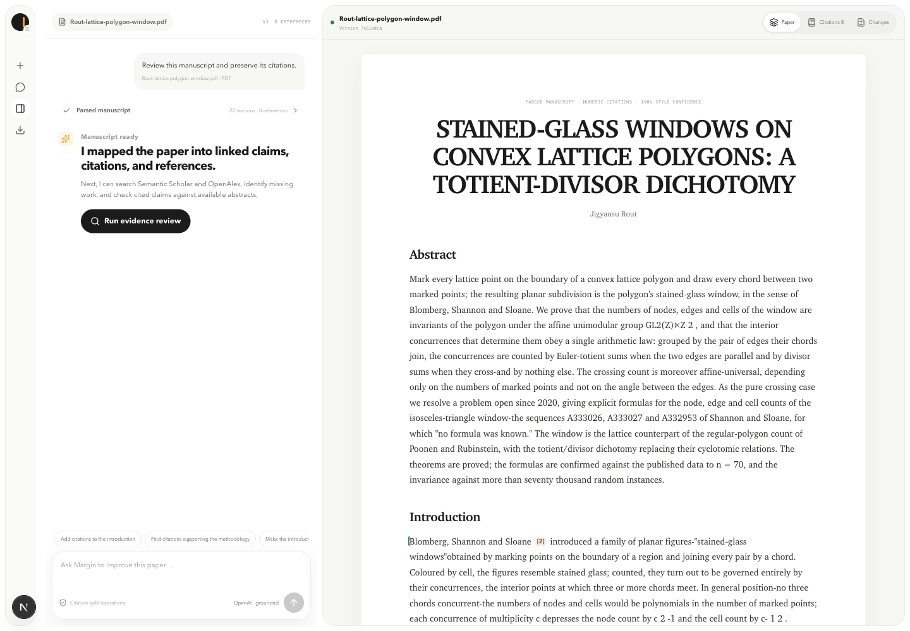
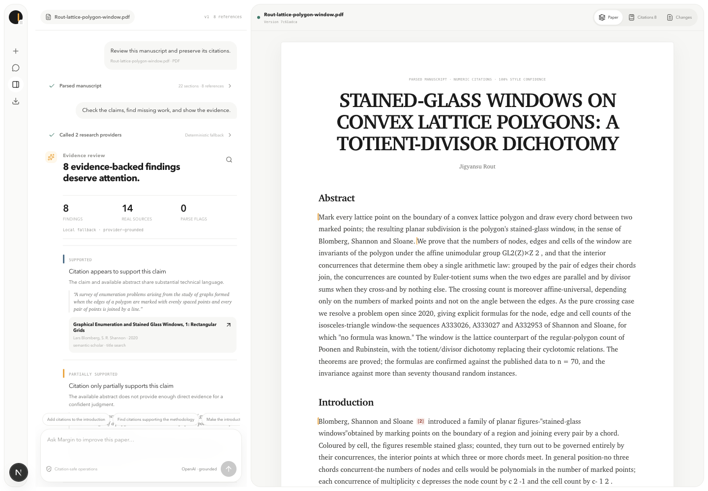
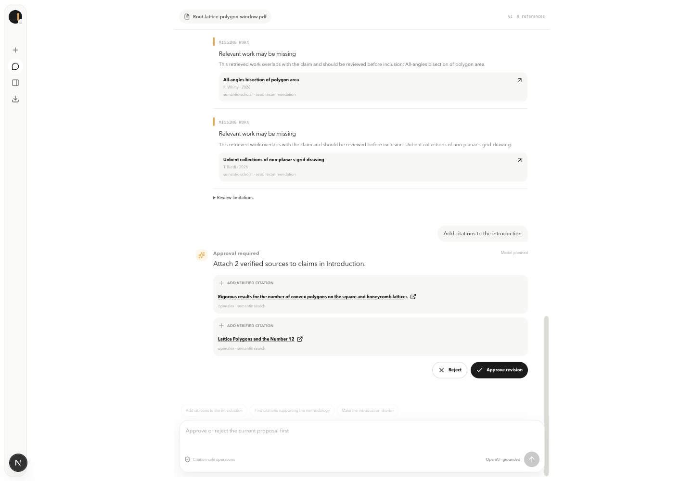
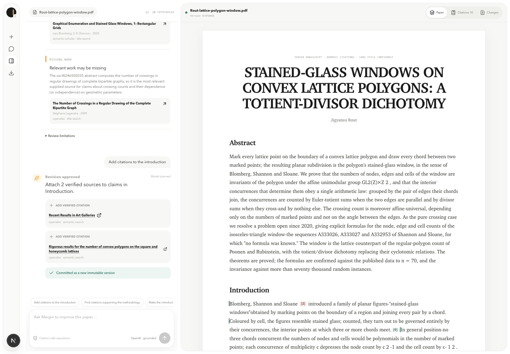
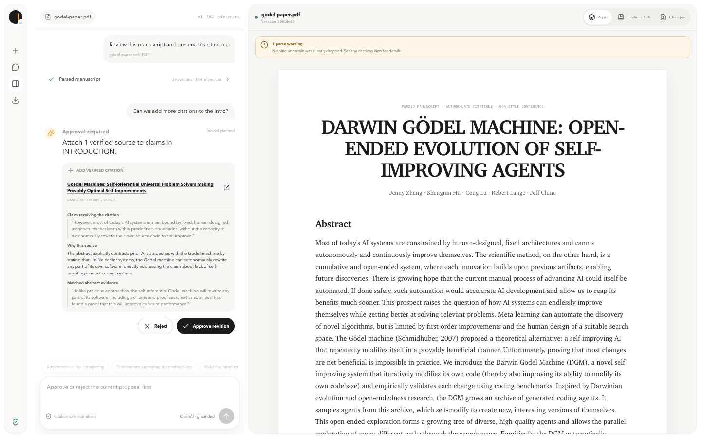
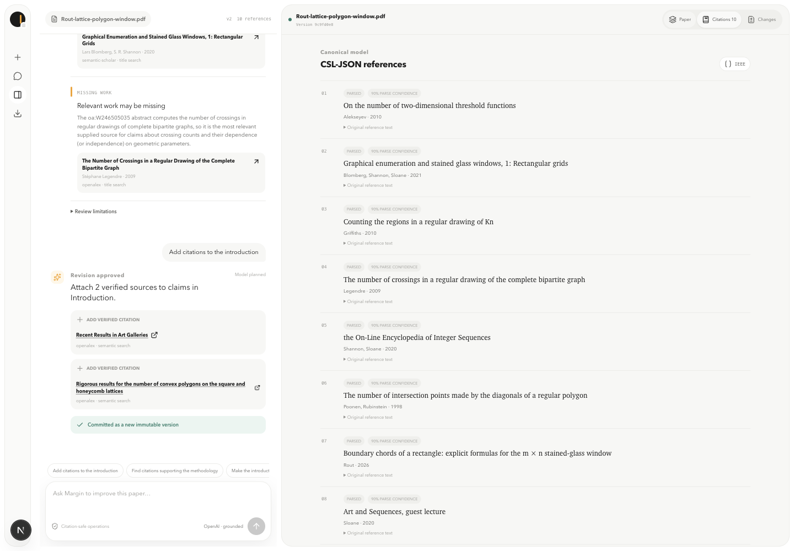
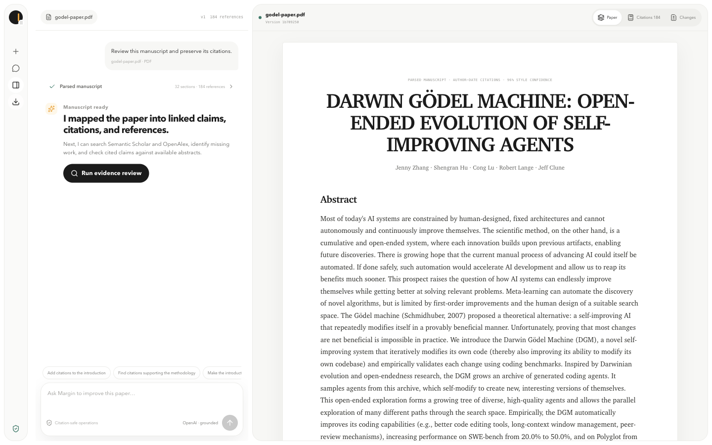
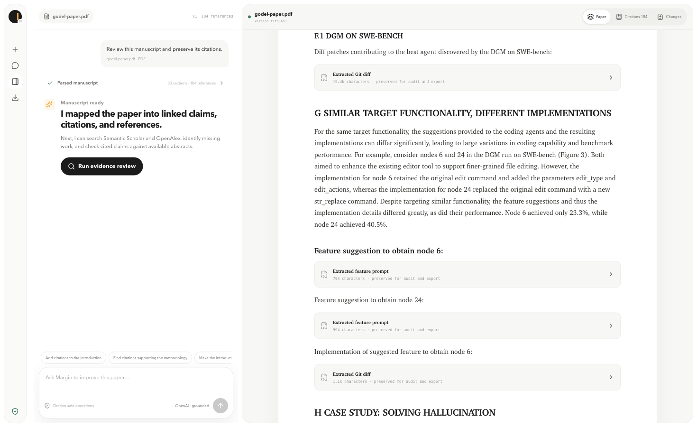
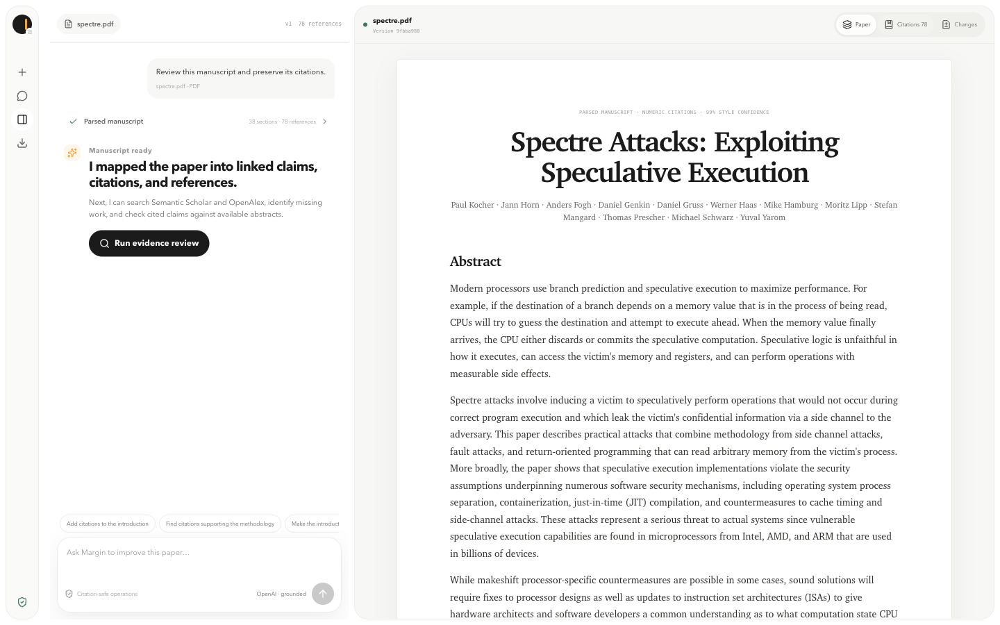
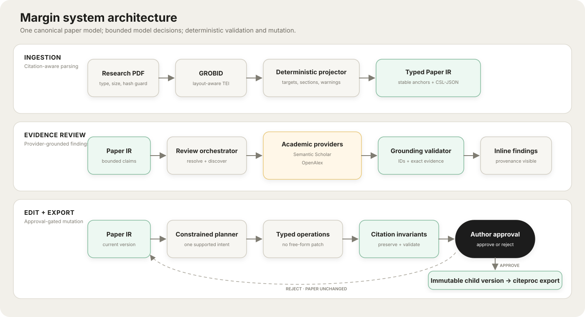

# Margin — evidence-first paper improvement

I built Margin as a working AnswerThis-style research-paper agent. A researcher uploads a PDF, follows a durable review thread grounded in Semantic Scholar and OpenAlex, inspects the parsed manuscript and CSL-JSON references, proposes a natural-language edit, approves a typed diff, and exports a rebuilt PDF/TeX bundle.

I deliberately favored a coherent, explainable slice over a wide feature surface: one canonical paper model, three constrained edit operations, two scholarly providers, immutable versions, and executable citation invariants.

## Interviewer quick read

| Assessment requirement | Implementation |
|---|---|
| Product opens on upload | `/` is the workbench; there is no landing page |
| Structured PDF parsing | GROBID full-text TEI → typed `Paper` intermediate representation |
| Multiple citation styles | Numeric and author-date markers; IEEE/APA CSL detection plus a user override |
| Honest parse failures | Unlinked callouts remain verbatim and visible; the parser never invents a bibliography record |
| Both academic providers | Semantic Scholar + OpenAlex adapters behind one deduplicating boundary |
| Grounded peer review | Supplied provider IDs only; abstract evidence is substring-validated |
| Natural-language edits | Model produces a small plan; application code executes typed operations |
| Human control | Every edit is a pending proposal until explicit approve/reject |
| Explainable citation approval | Every proposed citation shows the target claim, why the source supports it, and one exact abstract sentence |
| Citation safety | Existing anchor ID, multiplicity, and sentence location are immutable |
| CSL, not hand formatting | Every reference is CSL-JSON; Pandoc citeproc + official `.csl` styles render output |
| Real export | ZIP contains revised PDF, TeX, CSL-JSON, style, and validation report |
| Messy-PDF recovery | Pseudo-headings become prose/code, merged bibliography rows are split, and TeX accents/author spillover are repaired deterministically |
| Cross-domain validation | Five influential systems/ML/security papers (68 pages) pass the executable corpus audit with 374 linked anchors and no warnings |
| Core tests | TEI projection, style detection, normalization, edit invariants, and export serialization |
| Explainable UX | Compact workspace rail, durable tool/result thread, persistent command composer, and adjacent manuscript artifact |

The two system-design sections weighted most heavily in the prompt are documented in [SYSTEM_DESIGN.md](SYSTEM_DESIGN.md).

## Run it

### Docker Compose (recommended)

Requirements: Docker Desktop and roughly 6 GB of free memory. The first GROBID image pull is about 1.7 GB.

```bash
cp .env.example .env.local
# Add OPENAI_API_KEY to .env.local for model review/edit planning.
docker compose up --build
```

Open [http://localhost:3000](http://localhost:3000). Compose waits for GROBID's health check before starting the web service.

`SEMANTIC_SCHOLAR_API_KEY` is optional. When configured, all Semantic Scholar endpoints and retries share a 1.1-second request gate to remain below the free-key one-request-per-second limit. `OPENALEX_API_KEY` is optional for light use but recommended for stable quotas. With no OpenAI key, the app labels and uses a deterministic review/edit fallback instead of hiding the limitation.

### Local development

Requirements: Node 24+, pnpm, Docker, Pandoc, and XeLaTeX (preferred), Tectonic, or `pdflatex`.

```bash
cp .env.example .env.local
docker compose up -d grobid
pnpm install
pnpm dev
```

On macOS, the export dependencies can be installed with:

```bash
brew install pandoc tectonic
```

## Real-paper workflow

I captured the screenshots below from live runs, not seeded demo data. For the final stress test, I used the 72-page *Darwin Gödel Machine* paper. Its latest canonical projection contains 39 sections, 184 CSL records, and 255 citation anchors. I preserve five ambiguous callouts verbatim and surface one visible `unlinked_citations` warning instead of guessing. I collapse code/diff payloads into labelled audit blocks rather than rendering them as prose, and no return-arrow extraction artifacts remain. The review reached both providers and excludes the uploaded and already-cited works from eligible suggestions.

I designed the interface around one simple spatial model: research activity accumulates in the thread, the canonical manuscript stays visible beside it, and the command composer remains in reach. I collapse tool calls into inspectable status rows and keep failures and approvals in context instead of using transient toasts. The manuscript can be hidden for focused review, while mobile uses an explicit Thread/Manuscript switch.

| Parsed paper | Live evidence review |
|---|---|
|  |  |

| Approval-gated edit | Approved revision |
|---|---|
|  |  |

I made citation approval auditable before mutation by showing the exact manuscript claim, a claim-specific rationale, and one contiguous provider-abstract sentence together. In the live Gödel run, I also verified Unicode-safe self-paper exclusion (`Gödel` vs `Godel`) and rejection of weak same-topic matches.



I expose parse confidence, original bibliography text, DOI links, and the CSL style selector in the citations view:



I captured the hardened 72-page Gödel run below:



I preserve long source appendices but collapse them by default. I split GROBID-combined appendix headings back into their parent/child hierarchy and give diffs, tool definitions, agent traces, prompts, and benchmark-instance payloads explicit labels and bounded, scrollable disclosures:



I also tested against Transformer, ResNet, Raft, MapReduce, and Spectre to prevent overfitting. The final live run projected 141 sections, 212 real bibliography records, and 374 in-text anchors with zero unresolved references and zero parse warnings. I treated Spectre as the most adversarial case because its IEEE lettered outline, inline Roman headings, acknowledgement wrapper, nested appendices, URL-only references, and C listing exercise different recovery paths. The screenshot below comes from the production Docker image after the corpus audit; I preserve Appendix C code in the manuscript while excluding it from the 78-item bibliography.



Paper URLs, checksums, per-paper results, failure history, and the exact audit contract are in [docs/CORPUS_VALIDATION.md](docs/CORPUS_VALIDATION.md).

## Architecture at a glance



I never allow the model to write directly to the document or create bibliography metadata. It may select supplied source IDs or propose text inside a schema; I keep provider hydration, source validation, edit application, integrity checks, persistence, and rendering in ordinary code.

## Citation safety contract

Approval is transactional and fails unless all of these remain true:

1. Every pre-existing citation anchor appears exactly as many times as before.
2. Every pre-existing anchor remains attached to the same sentence ID.
3. Every citation points to a reference present in the canonical CSL-backed library.
4. Every new source has a real provider ID and link from Semantic Scholar or OpenAlex.
5. A proposal is based on the current version; stale proposals cannot commit.
6. Every new citation records the target claim, a rationale, and an exact one-sentence abstract excerpt; partial explanations, self-citations, and weak lexical matches are rejected.

I chose this contract because it is stronger than asking an LLM to “preserve citations” in a prompt.

## Code map

| Area | Files | Responsibility |
|---|---|---|
| Domain | `lib/domain.ts` | Strict Zod schemas for paper IR, CSL, findings, proposals, and snapshots |
| Parsing | `lib/grobid.ts`, `lib/tei-projector.ts` | PDF → TEI and deterministic TEI → canonical paper projection |
| Search | `lib/scholarly/*` | Provider adapters, retries, cache, matching, deduplication |
| Review | `lib/review.ts` | Bounded claim selection, abstract-grounded judgments, safe fallback |
| Editing | `lib/edit.ts`, `lib/invariants.ts` | Command planning, typed operations, citation-preservation checks |
| Persistence | `lib/db.ts`, `lib/repository.ts` | SQLite WAL, immutable versions, reviews, proposals, provider cache |
| Export | `lib/export.ts` | Pandoc Markdown, citeproc, TeX/PDF, validation report, ZIP |
| API | `app/api/documents/**` | Thin request/response boundary around domain services |
| UI | `components/**`, `app/globals.css` | Responsive rail, durable review thread, command composer, and manuscript artifact |

I kept the roughly 5,000 production lines, including responsive CSS, organized into small modules instead of a framework-heavy service graph.

## API surface

| Method | Route | Purpose |
|---|---|---|
| `POST` | `/api/documents` | Validate, store, parse, and project one PDF |
| `GET` | `/api/documents/:id` | Read the current document snapshot |
| `PATCH` | `/api/documents/:id` | Apply an explicit APA/IEEE CSL style override as a new version |
| `POST` | `/api/documents/:id/review` | Resolve citations, discover work, and generate findings |
| `POST` | `/api/documents/:id/proposals` | Plan and validate one natural-language edit |
| `PATCH` | `/api/documents/:id/proposals/:proposalId` | Approve or reject the pending proposal |
| `POST` | `/api/documents/:id/export` | Validate and return the rebuilt ZIP bundle |

## Verification

```bash
pnpm typecheck
pnpm test
pnpm build
docker compose config --quiet
npm run test:corpus -- /Users/iamjr15/Desktop/answerthis-paper-corpus
```

I test:

- numeric and author-date TEI projection;
- structured CSL fields and verbatim preservation of unresolved callouts;
- pseudo-heading/code recovery, merged-reference splitting, TeX-accent cleanup, and raw-author recovery;
- TEI numbering, running-header removal, inline Roman headings, alphabetic subsection hierarchy, nested back-matter/appendix traversal, URL-only references, and code-like bibliography rejection;
- DOI/title normalization (including diacritics), provider author-order normalization, and cross-provider deduplication;
- missing-work allowlisting, self-paper filtering, and recommendation deduplication;
- rewrite anchor preservation;
- rejection of anchor removal and cross-sentence movement;
- provider-hydrated citation insertion with claim-level rationale and exact abstract evidence; and
- stable citeproc IDs plus portable Unicode-math serialization.

In the live acceptance run, I additionally verified GROBID health, Semantic Scholar and OpenAlex status, granular review progress, both the structured model path and bounded fallback, APA/IEEE body re-rendering, a valid 72-page PDF, responsive 390 px layout, XeLaTeX output, and ZIPs with no CRC errors. I also run a second real-ingestion gate that sends five unrelated papers sequentially through the production API and rejects dangling anchors, invalid hierarchy, extraction arrows, merged headings, citations in code, and code promoted to bibliography records. Spectre additionally completed a model-backed two-provider review and a seven-file export with 129 anchors, 78 references, and no unresolved items or warnings. I enforce the 20 MB guard before persistence.

## Failure behavior

- A scanned/no-text PDF becomes `NEEDS_OCR`; OCR is not silently simulated.
- Missing reference targets remain unlinked citation nodes with their original text; no synthetic CSL record is created.
- Provider 429/5xx responses receive bounded exponential backoff; results are cached for seven days.
- Missing abstracts become `INSUFFICIENT_ABSTRACT`, never “contradicted.”
- Search returning no verifiable source produces a visible error, not an invented citation.
- Model failure or the configurable 60-second deadline selects a clearly labelled deterministic fallback.
- Typesetting has a 90-second process timeout and returns a visible export error.

## AI-tool disclosure

AI coding tools were used for architecture exploration, implementation assistance, and UI iteration. I independently verified the parts where generated code is most dangerous:

- read the assessment against the final behavior;
- tested both provider endpoints with real identifiers;
- ran the full browser workflow on a real paper;
- inspected stored review/provider provenance;
- regression-tested citation removal and movement;
- opened the generated ZIP, parsed its validation report, verified the PDF signature, and visually inspected desktop/mobile manuscript output; and
- ran type checking, unit tests, and a production build.

No AI-generated bibliography record is accepted. New references originate only from Semantic Scholar or OpenAlex and retain their provider IDs.

## Known limitations / next work

- GROBID remains the semantic parser of record because it exposes structured bibliography entries and linked in-text `bibr` targets. Docling is the preferred future sidecar for richer tables, formulas, pictures, and reading order; replacing GROBID outright would weaken the citation-linking requirement. The IR preserves scholarly text/citations, not original page geometry.
- Claim support uses abstracts, as requested; full-text entailment would need rights-aware retrieval and a separate evidence policy.
- Editing is intentionally limited to shortening, adding citations, and adding one abstract-backed claim. Large structural rewrites are rejected.
- SQLite and local disk target a single-user assessment deployment. Multi-user production would add authentication, object storage, Postgres, a queue, and tenant-level quotas.
- OCR is surfaced but not implemented. A production path would route `NEEDS_OCR` through a layout-aware OCR service and then through the same TEI/IR contract.
- GROBID and TeX make the container larger than a typical Next.js image; production would split parsing and export into workers.
