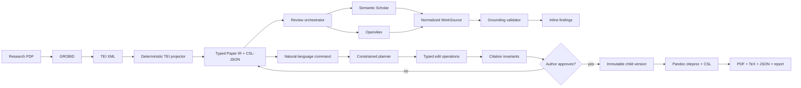

# Margin — evidence-first paper improvement

Margin is a working AnswerThis-style research-paper agent. A researcher uploads a PDF, inspects the parsed structure and CSL-JSON references, requests a review grounded in Semantic Scholar and OpenAlex, proposes a natural-language edit, approves a typed diff, and exports a rebuilt PDF/TeX bundle.

The implementation deliberately favors a coherent, explainable slice over a wide feature surface: one canonical paper model, three constrained edit operations, two scholarly providers, immutable versions, and executable citation invariants.

## Interviewer quick read

| Assessment requirement | Implementation |
|---|---|
| Product opens on upload | `/` is the workbench; there is no landing page |
| Structured PDF parsing | GROBID full-text TEI → typed `Paper` intermediate representation |
| Multiple citation styles | Numeric and author-date markers; IEEE/APA CSL detection plus a user override |
| Honest parse failures | Unresolved targets and low-confidence references remain visible with warnings |
| Both academic providers | Semantic Scholar + OpenAlex adapters behind one deduplicating boundary |
| Grounded peer review | Supplied provider IDs only; abstract evidence is substring-validated |
| Natural-language edits | Model produces a small plan; application code executes typed operations |
| Human control | Every edit is a pending proposal until explicit approve/reject |
| Citation safety | Existing anchor ID, multiplicity, and sentence location are immutable |
| CSL, not hand formatting | Every reference is CSL-JSON; Pandoc citeproc + official `.csl` styles render output |
| Real export | ZIP contains revised PDF, TeX, CSL-JSON, style, and validation report |
| Core tests | TEI projection, style detection, normalization, edit invariants, and export serialization |

The two system-design sections weighted most heavily in the prompt are documented in [SYSTEM_DESIGN.md](SYSTEM_DESIGN.md). The scoped delivery plan and risk register are in [PLAN.md](PLAN.md).

## Run it

### Docker Compose (recommended)

Requirements: Docker Desktop and roughly 6 GB of free memory. The first GROBID image pull is about 1.7 GB.

```bash
cp .env.example .env.local
# Add OPENAI_API_KEY to .env.local for model review/edit planning.
docker compose up --build
```

Open [http://localhost:3000](http://localhost:3000). Compose waits for GROBID's health check before starting the web service.

`SEMANTIC_SCHOLAR_API_KEY` is optional. `OPENALEX_API_KEY` is optional for light use but recommended for stable quotas. With no OpenAI key, the app labels and uses a deterministic review/edit fallback instead of hiding the limitation.

### Local development

Requirements: Node 24+, pnpm, Docker, Pandoc, and Tectonic or `pdflatex`.

```bash
cp .env.example .env.local
docker compose up -d grobid
pnpm install
pnpm dev
```

On macOS, the export dependencies can be installed with:

```bash
brew install pandoc tectonic
```

## Real-paper workflow

The screenshots below were captured from a live run on a nine-page research paper—not seeded demo data. GROBID extracted eight original references. Review used both provider boundaries, the approved edit added two real sources, and export produced ten CSL entries with zero unresolved references.

| Parsed paper | Live evidence review |
|---|---|
|  |  |

| Approval-gated edit | Approved revision |
|---|---|
|  |  |

The citations view exposes parse confidence, original bibliography text, DOI links, and the CSL style selector:


## Architecture at a glance



The model never writes directly to the document and never creates bibliography metadata. It may select supplied source IDs or propose text inside a schema; provider hydration, source validation, edit application, integrity checks, persistence, and rendering are ordinary code.

## Citation safety contract

Approval is transactional and fails unless all of these remain true:

1. Every pre-existing citation anchor appears exactly as many times as before.
2. Every pre-existing anchor remains attached to the same sentence ID.
3. Every citation points to a reference present in the canonical CSL-backed library.
4. Every new source has a real provider ID and link from Semantic Scholar or OpenAlex.
5. A proposal is based on the current version; stale proposals cannot commit.

This is intentionally stronger than asking an LLM to “preserve citations” in a prompt.

## Code map

| Area | Files | Responsibility |
|---|---|---|
| Domain | `lib/domain.ts` | Strict Zod schemas for paper IR, CSL, findings, proposals, and snapshots |
| Parsing | `lib/grobid.ts`, `lib/tei-projector.ts` | PDF → TEI and deterministic TEI → canonical paper projection |
| Search | `lib/scholarly/*` | Provider adapters, retries, cache, matching, deduplication |
| Review | `lib/review.ts` | Bounded claim selection, abstract-grounded judgments, safe fallback |
| Editing | `lib/edit.ts`, `lib/invariants.ts` | Command planning, typed operations, citation-preservation checks |
| Persistence | `lib/db.ts`, `lib/repository.ts` | SQLite WAL, immutable versions, reviews, proposals, provider cache |
| Export | `lib/export.ts` | Pandoc Markdown, citeproc, TeX/PDF, validation report, ZIP |
| API | `app/api/documents/**` | Thin request/response boundary around domain services |
| UI | `components/**`, `app/globals.css` | Responsive upload/review/paper workbench |

There are about 5,000 production lines including the responsive CSS. The core behavior stays in small modules rather than a framework-heavy service graph.

## API surface

| Method | Route | Purpose |
|---|---|---|
| `POST` | `/api/documents` | Validate, store, parse, and project one PDF |
| `GET` | `/api/documents/:id` | Read the current document snapshot |
| `PATCH` | `/api/documents/:id` | Apply an explicit APA/IEEE CSL style override as a new version |
| `POST` | `/api/documents/:id/review` | Resolve citations, discover work, and generate findings |
| `POST` | `/api/documents/:id/proposals` | Plan and validate one natural-language edit |
| `PATCH` | `/api/documents/:id/proposals/:proposalId` | Approve or reject the pending proposal |
| `POST` | `/api/documents/:id/export` | Validate and return the rebuilt ZIP bundle |

## Verification

```bash
pnpm typecheck
pnpm test
pnpm build
docker compose config --quiet
```

The test suite covers:

- numeric and author-date TEI projection;
- structured CSL fields and missing-target materialization;
- DOI/title normalization and cross-provider deduplication;
- rewrite anchor preservation;
- rejection of anchor removal and cross-sentence movement;
- provider-hydrated citation insertion; and
- stable citeproc IDs plus portable Unicode-math serialization.

The live acceptance run additionally verified invalid-upload rejection, GROBID health, OpenAI authentication, both scholarly endpoints, a two-version approval path, a valid nine-page PDF, a readable ten-entry bibliography, and a ZIP with no CRC errors. The 20 MB guard is enforced before persistence.

## Failure behavior

- A scanned/no-text PDF becomes `NEEDS_OCR`; OCR is not silently simulated.
- Missing reference targets are materialized as unresolved CSL records.
- Provider 429/5xx responses receive bounded exponential backoff; results are cached for seven days.
- Missing abstracts become `INSUFFICIENT_ABSTRACT`, never “contradicted.”
- Search returning no verifiable source produces a visible error, not an invented citation.
- Model failure selects a clearly labelled deterministic fallback.
- Typesetting has a 90-second process timeout and returns a visible export error.

## AI-tool disclosure

AI coding tools were used for architecture exploration, implementation assistance, and UI iteration. I independently verified the parts where generated code is most dangerous:

- read the assessment against the final behavior;
- tested both provider endpoints with real identifiers;
- ran the full browser workflow on a real paper;
- inspected stored review/provider provenance;
- regression-tested citation removal and movement;
- opened the generated ZIP, parsed the validation report, extracted the PDF text, and visually inspected all nine rendered pages; and
- ran type checking, unit tests, and a production build.

No AI-generated bibliography record is accepted. New references originate only from Semantic Scholar or OpenAlex and retain their provider IDs.

## Known limitations / next work

- GROBID is strong across common scholarly PDFs but cannot perfectly recover figures, equations, tables, footnotes, or multi-column reading order. The IR preserves text/citations, not original page geometry.
- Claim support uses abstracts, as requested; full-text entailment would need rights-aware retrieval and a separate evidence policy.
- Editing is intentionally limited to shortening, adding citations, and adding one abstract-backed claim. Large structural rewrites are rejected.
- SQLite and local disk target a single-user assessment deployment. Multi-user production would add authentication, object storage, Postgres, a queue, and tenant-level quotas.
- OCR is surfaced but not implemented. A production path would route `NEEDS_OCR` through a layout-aware OCR service and then through the same TEI/IR contract.
- GROBID and TeX make the container larger than a typical Next.js image; production would split parsing and export into workers.

## Third-party components

GROBID, Pandoc, Tectonic/TeX, and Citation Style Language files are used under their respective licenses. The bundled APA and IEEE styles come from the official Citation Style Language styles repository. See [THIRD_PARTY_NOTICES.md](THIRD_PARTY_NOTICES.md).
