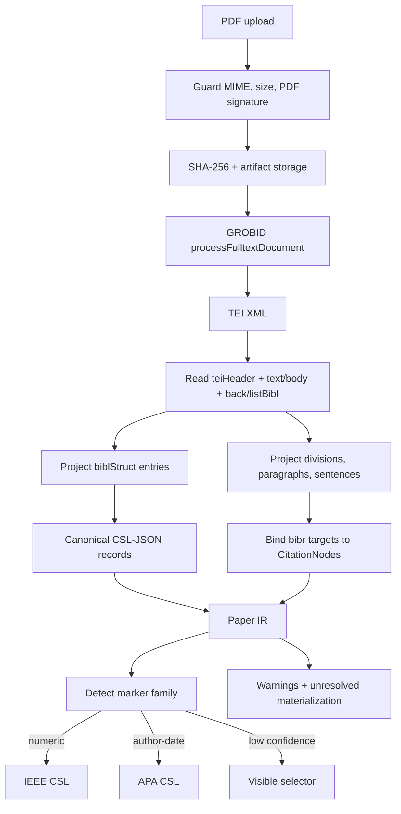
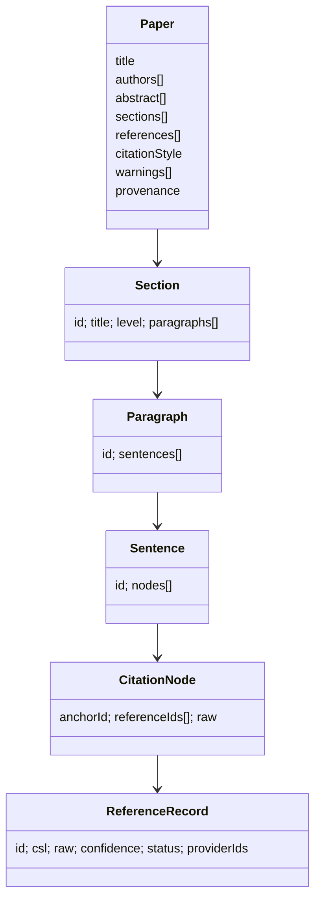
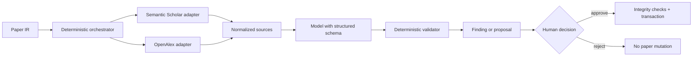
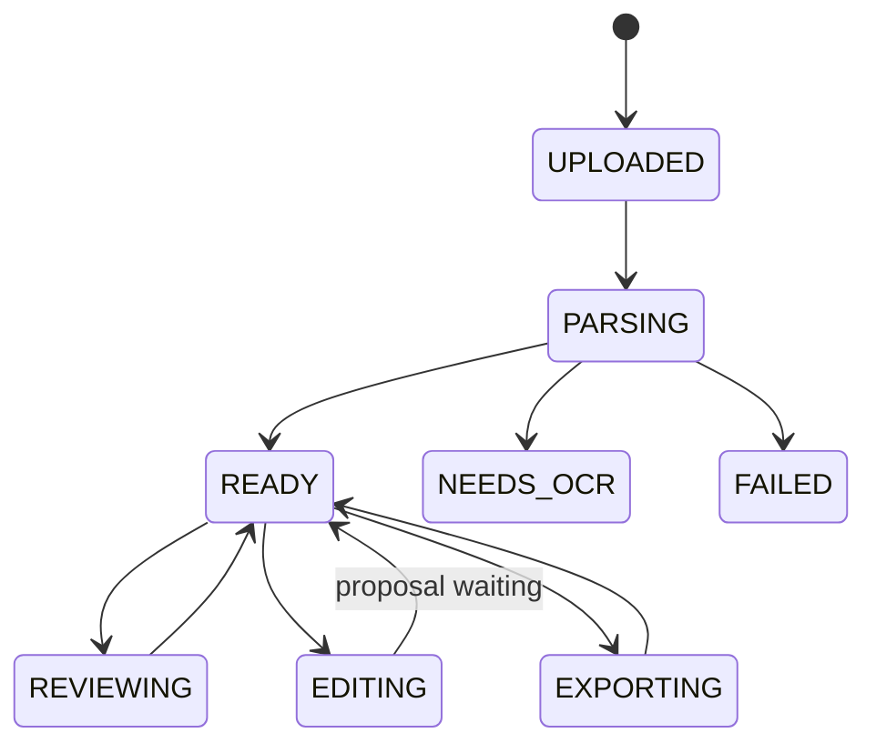

# System design

The assessment gives highest weight to two designs: citation parsing and the review/editing agent. This document describes the implemented path, its invariants, and the boundaries where uncertainty remains visible.

## Design principles

1. **Canonicalize early.** After ingestion, every part of the system consumes one typed paper IR and CSL-JSON references.
2. **Separate retrieval from judgment.** Providers supply works; a reviewer judges only supplied abstracts; validators reject unknown IDs.
3. **Treat citations as data, not characters.** Citation nodes have stable IDs and reference links independent of rendered `[4]` or `(Smith, 2024)` text.
4. **Constrain mutation.** Natural language selects a small intent; ordinary code executes typed operations.
5. **Fail visibly.** Unknown reference targets, missing abstracts, provider failures, unsupported commands, and OCR needs remain explicit states.
6. **Commit only validated state.** Proposals are untrusted until invariants pass and the author approves against the current version.

---

# 1. Citation parsing design

## Pipeline



## Step-by-step algorithm

### Step 1 — validate and preserve source provenance

The upload route accepts one `paper` part, enforces PDF type/signature and `MAX_PDF_BYTES` (20 MB by default), hashes the exact bytes, creates a document row, and writes the original file under the document directory. The hash and original artifact make later results attributable to a specific input.

### Step 2 — extract scholarly text and layout structure

The parser calls GROBID's `processFulltextDocument` rather than attempting to infer scholarly layout with application regex. It requests:

- generated XML IDs;
- sentence segmentation;
- raw reference strings;
- reference and bibliography coordinates; and
- no external consolidation, because provider lookup is handled behind explicit application adapters.

GROBID performs layout-aware PDF tokenization, header/body segmentation, bibliography-zone detection, entry segmentation, and bibliographic field parsing. The returned TEI is retained alongside the source PDF for debugging.

### Step 3 — locate and segment the bibliography

The projector reads only TEI `listBibl > biblStruct` entries from the back matter. Header metadata is not accidentally treated as a cited work. One `biblStruct` becomes one `ReferenceRecord` with:

- stable TEI ID;
- original raw entry text;
- parsed confidence;
- resolution status;
- provider IDs when known; and
- a canonical CSL item.

This is deterministic tree traversal. It does not split a reference list on line breaks or assume that every entry begins with `[n]`.

### Step 4 — normalize each entry to CSL-JSON

The projector maps TEI fields into CSL:

| TEI | CSL-JSON |
|---|---|
| `title` | `title` |
| analytic authors | `author[]` with `family` / `given` / `literal` |
| monograph/journal title | `container-title` |
| publication date | `issued.date-parts` |
| volume / issue / pages | `volume` / `issue` / `page` |
| DOI / URL | `DOI` / `URL` |
| entry kind | CSL `type` |

CSL item IDs are stable internal reference IDs. Provider lookups may enrich the same model later, but no downstream component owns a second bibliography schema.

Confidence reflects field evidence: title, author, year, and DOI contribute independently. Low confidence is displayed; an entry is not dropped because some fields are missing.

### Step 5 — project document structure

TEI `div`, `head`, `p`, and `s` elements become `Section`, `Paragraph`, and `Sentence` records. Each sentence contains an ordered node list:

```ts
type SentenceNode =
  | { type: "text"; value: string }
  | {
      type: "citation";
      anchorId: string;
      referenceIds: string[];
      raw: string;
    };
```

This node model is the central round-trip decision. Rendering a numeric marker is a view concern; preserving the semantic link is a domain concern.

### Step 6 — locate and bind in-text markers

For each TEI `ref[type=bibr]` encountered inside a sentence, the projector:

1. keeps the marker in its exact node order;
2. assigns/retains a stable anchor ID;
3. parses all `target` IDs in a citation cluster;
4. binds them to the reference library; and
5. retains the raw marker for auditability.

If a target has no bibliography entry, the projector creates an unresolved reference record and warning. The marker therefore remains visible and structurally valid instead of disappearing.

### Step 7 — detect or select the citation style

Marker shapes, not formatted bibliography strings, vote for a family:

- bracketed/plain numeric markers → `numeric` / IEEE CSL;
- author-year markers → `author-date` / APA CSL.

The winning family must account for at least 60% of observed markers. Otherwise the family is `unknown`, confidence is shown, and APA is only a temporary default. The citations UI always exposes an APA/IEEE selector; changing it creates another version rather than mutating history.

This selector is intentionally narrow for the assessment. Adding another CSL style means vendoring its `.csl` file and extending the allowed style IDs, not writing a formatter.

### Step 8 — surface failure modes

| Condition | Result |
|---|---|
| No extractable text / scanned PDF | Document state `NEEDS_OCR` with visible message |
| GROBID unavailable | Retry one saturation response, then return typed 503 |
| No body | `missing_body` warning |
| No reference list | `missing_reference_list` warning |
| Missing in-text target | Unresolved CSL record + `missing_reference_target` warning |
| Partially parsed entry | Original raw string remains visible with confidence |
| Mixed/unknown marker style | `unknown` family + confidence + manual CSL selector |

## Intermediate representation



All schemas are strict Zod objects. Persisted JSON is parsed again on reads, so corrupt or shape-drifting state fails near the repository boundary.

## Why GROBID + a deterministic projector

The application does not outsource the whole problem to a black box. GROBID owns the hard layout/statistical parsing work for which it is designed. The small projector owns application semantics: what counts as a reference, how TEI targets bind, how CSL is shaped, how warnings materialize, and what IDs edits must preserve. Fixtures can therefore test the domain contract without running a 1.7 GB parser container.

## Parsing limitations

This IR reconstructs scholarly semantics, not original page design. Figures, tables, equations, footnotes, and exact typography are not lossless. Math extracted as Unicode is normalized for portable TeX where common symbols are known, but complex formula recovery would require a math-aware PDF/TEI path. These limitations are more honest than presenting a visually identical but structurally broken PDF.

---

# 2. Review and editing agent design

## Trust boundary



The model is inside the trust boundary but not at its edge. It cannot call arbitrary tools, invent metadata that becomes CSL, or replace the paper wholesale.

## Scholarly provider boundary

Both adapters return the same `WorkSource`:

- normalized stable ID (`doi:*`, provider ID fallback);
- title, authors, year, abstract, DOI, and link;
- provider-specific IDs;
- one or both provider provenance labels;
- retrieval method; and
- a CSL item.

Calls have 20-second timeouts, at most three attempts, exponential backoff with jitter, `Retry-After` support, and a seven-day SQLite cache. A failure from one provider does not erase results from the other.

### Existing-citation resolution

1. Select references used by the bounded cited-claim sample.
2. Batch DOI resolution concurrently against Semantic Scholar and OpenAlex.
3. Merge duplicates by normalized DOI, otherwise normalized title + year.
4. For up to four unresolved references, query both providers by title.
5. Accept a title fallback only with Jaccard token overlap ≥ 0.72 and a year within ±1 when both years exist.
6. Retain provider provenance and prefer the richer available abstract.

### Missing-work discovery

1. Build a query from paper title, section context, and up to three uncited claims.
2. Run Semantic Scholar search, Semantic Scholar seed recommendations (when cited S2 IDs exist), and OpenAlex semantic search concurrently.
3. Merge/deduplicate results.
4. Exclude DOI/title identities already in the paper.
5. Pass only a bounded candidate set to the reviewer.

Retrieval method labels remain visible (`exact-id`, `title-search`, `semantic-search`, `seed-recommendation`). A search result is described as a candidate, not a proven omission.

## Peer-review execution

The reviewer examines at most ten cited claims and three uncited claims in one run. This makes latency, prompt size, and reviewer scope predictable.

The model receives:

- immutable sentence IDs and claim text;
- source IDs already allowed for each cited claim;
- candidate source IDs for missing work; and
- provider-supplied title, year, and abstract only.

It returns a strict schema with citation matches and missing-work candidates. Application code then rejects a finding unless:

1. its sentence exists in the supplied claim set;
2. its source exists in the supplied catalog;
3. a citation-match source was actually attached to that claim; and
4. non-insufficient evidence is an exact contiguous substring of the provider abstract.

Verdicts are deliberately asymmetric:

- `SUPPORTED`
- `PARTIALLY_SUPPORTED`
- `CONTRADICTED`
- `INSUFFICIENT_ABSTRACT`

No abstract or weak evidence becomes insufficient—not contradiction. The UI also persists the limitation that abstract evidence is not full-text evidence.

If OpenAI is not configured or a structured response fails, a labelled lexical fallback produces conservative partial/insufficient findings. It never fabricates source metadata.

## Natural-language edit planning

A first structured call maps a command to one of four intents and a supplied section ID:

| Intent | Execution |
|---|---|
| `SHORTEN_SECTION` | Rewrite a bounded set of long sentences while application code retains citation nodes |
| `ADD_CITATIONS` | Find provider-backed sources and attach them to up to two uncited sentences |
| `ADD_SOURCED_CLAIM` | Select one provider abstract and author one conservative cited sentence |
| `UNSUPPORTED` | Return a visible 422; do not guess |

The planner cannot return arbitrary JavaScript, SQL, document patches, or reference metadata.

### Typed operation log

```ts
type EditOperation =
  | {
      type: "replace-sentence";
      sentenceId: string;
      beforeText: string;
      afterText: string;
    }
  | {
      type: "add-citation";
      sentenceId: string;
      source: WorkSource;
    }
  | {
      type: "add-sourced-sentence";
      sectionId: string;
      afterSentenceId?: string;
      text: string;
      sources: WorkSource[];
    };
```

This log powers the approval diff and is the only mutation input accepted by `applyProposal`.

## Citation integrity

There are safeguards at three moments.

### Proposal validation

- rewrites cannot be empty;
- added sources require a link and at least one provider ID; and
- new claims require provider sources and model access.

### Application

- rewrites replace only text nodes and reattach the untouched citation-node objects;
- citations are appended as new nodes with new stable anchor IDs;
- new references are created from the source's provider-hydrated CSL item; and
- stale `beforeText` causes a conflict instead of a blind rewrite.

### Pre-commit invariant

For every pre-existing anchor, the validator compares the ordered sentence-location list before and after. This detects deletion, duplication, and movement. It then verifies that every post-edit reference ID exists in the bibliography.

The proposal also stores `baseVersionId`. Approval begins an immediate SQLite transaction, checks that this is still the document's current version, writes a child version, marks the proposal approved, and commits. A stale proposal rolls back.

## Persistence and state transitions



SQLite tables:

| Table | Role |
|---|---|
| `documents` | Workflow status and current version pointer |
| `document_versions` | Immutable paper JSON and parent link |
| `reviews` | Review tied to the exact reviewed version |
| `edit_proposals` | Base version, operations, decision, timestamps |
| `api_cache` | Provider response cache with expiry |

WAL mode, foreign keys, and a five-second busy timeout are enabled. This is sufficient for a single-node assessment; it is not presented as a multi-tenant production database.

## Export path

1. Re-run citation integrity checks.
2. Serialize sections and citation nodes to Pandoc Markdown with stable `[@id]` cite keys.
3. Write every canonical CSL item to `references.json`.
4. Select the stored/detected official CSL style.
5. Run Pandoc citeproc to produce standalone TeX.
6. Typeset PDF with Tectonic when present, otherwise `pdflatex`.
7. Emit a validation report with anchor count, reference count, unresolved IDs, parse warnings, style, document ID, and version ID.
8. ZIP PDF, TeX, CSL-JSON, `.csl`, report, and readme.

The subprocess has a 90-second timeout. Common Unicode math symbols are serialized as TeX math so they do not silently disappear from Latin Modern output.

## Reliability and operational behavior

| Boundary | Control |
|---|---|
| Upload | 20 MB default limit, PDF signature/type, source hash |
| GROBID | Compose health gate, 120-second request timeout, one saturation retry |
| Providers | Parallel isolation, timeout, bounded backoff, cache, optional keys |
| OpenAI | 60-second client timeout, one SDK retry, strict output schemas |
| Mutation | One active proposal in UI, base-version conflict check, transaction |
| Export | Integrity pass, process timeout, validation artifact |
| Secrets | Server-only env names; `.env*` ignored except example |

## Scaling path

The clean boundaries allow a production evolution without rewriting the domain model:

- API nodes remain stateless except for repository calls.
- Original PDF/TEI/export artifacts move to object storage.
- SQLite repositories move to Postgres with the same version/proposal relationships.
- parse/review/export operations become idempotent queue jobs keyed by document/version.
- provider cache moves to Redis or Postgres with tenant quotas.
- SSE/WebSocket progress replaces one long request.
- authentication and document ownership guard every route.
- OCR becomes a separate ingestion adapter that still emits TEI or the same paper IR.

The assessment implementation does not add those systems prematurely; it keeps the seams needed to add them.
