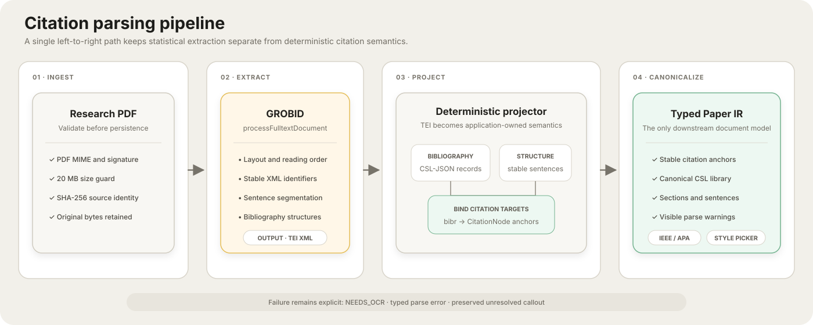
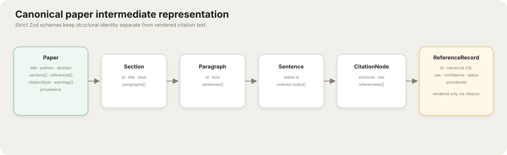
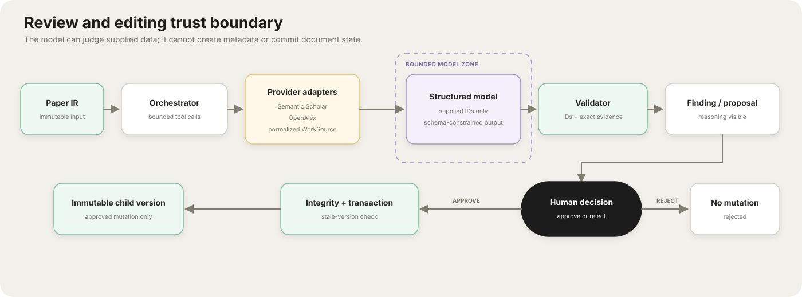
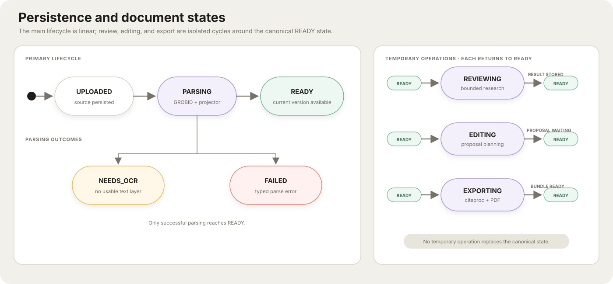

# System design

I have given the highest weight to two designs: citation parsing and the review/editing agent. This document describes the implemented path, its invariants, and the boundaries where uncertainty remains visible.

## Design principles

1. **Canonicalize early.** After ingestion, every part of the system consumes one typed paper IR and CSL-JSON references.
2. **Separate retrieval from judgment.** Providers supply works; a reviewer judges only supplied abstracts; validators reject unknown IDs.
3. **Treat citations as data, not characters.** Citation nodes have stable IDs and reference links independent of rendered `[4]` or `(Smith, 2024)` text.
4. **Constrain mutation.** Natural language selects a small intent; ordinary code executes typed operations.
5. **Fail visibly.** Unknown reference targets, missing abstracts, provider failures, unsupported commands, and OCR needs remain explicit states.
6. **Commit only validated state.** Proposals are untrusted until invariants pass and the author approves against the current version.

---

# 1. Citation parsing design

## Pipeline



## Step-by-step algorithm

### Step 1 — validate and preserve source provenance

I implemented the upload route to accept one `paper` part, enforce PDF type/signature and `MAX_PDF_BYTES` (20 MB by default), hash the exact bytes, create a document row, and write the original file under the document directory. The hash and original artifact make later results attributable to a specific input.

### Step 2 — extract scholarly text and layout structure

I call GROBID's `processFulltextDocument` rather than attempting to infer scholarly layout with application regex. I request:

- generated XML IDs;
- sentence segmentation;
- raw reference strings;
- reference, bibliography, heading, paragraph, and sentence coordinates; and
- no external consolidation, because provider lookup is handled behind explicit application adapters.

GROBID performs layout-aware PDF tokenization, header/body segmentation, bibliography-zone detection, entry segmentation, and bibliographic field parsing. The returned TEI is retained alongside the source PDF for debugging.

### Step 3 — locate and segment the bibliography

I made the projector read only TEI `listBibl > biblStruct` entries from the back matter, so header metadata cannot accidentally become a cited work. Normally one `biblStruct` becomes one `ReferenceRecord` with:

- stable TEI ID;
- original raw entry text;
- parsed confidence;
- resolution status;
- provider IDs when known; and
- a canonical CSL item.

This is deterministic tree traversal. It does not split a reference list on line breaks or assume that every entry begins with `[n]`. A narrow recovery handles GROBID rows that provably contain two raw references: a year-to-new-author boundary splits the raw entry, each child gets a stable derived ID, and author/year callouts are relinked only when the match is unique.

### Step 4 — normalize each entry to CSL-JSON

I map TEI fields into CSL as follows:

| TEI | CSL-JSON |
|---|---|
| `title` | `title` |
| analytic authors | `author[]` with `family` / `given` / `literal` |
| monograph/journal title | `container-title` |
| publication date | `issued.date-parts` |
| volume / issue / pages | `volume` / `issue` / `page` |
| DOI / URL | `DOI` / `URL` |
| entry kind | CSL `type` |

CSL item IDs are stable internal reference IDs. Provider lookups may enrich the same model later, but no downstream component owns a second bibliography schema.

Confidence reflects field evidence: title, author, year, and DOI contribute independently. Low confidence is displayed; an entry is not dropped because some fields are missing. Raw text also repairs two observable GROBID failure modes: trailing authors leaked into a title, and an author list truncated or shifted before that title. Recovery requires an exact cleaned-title boundary and a tightly bounded author-count difference.

### Step 5 — project document structure

TEI `div`, `head`, `p`, and `s` elements become `Section`, `Paragraph`, and `Sentence` records. Paragraphs are typed as prose or code. Hierarchy uses `head@n` when present, then deterministic Arabic/Roman/alphabetic outline rules. Coordinate-consistent repeated unnumbered heads are treated as running headers. Lowercase hyphen fragments rejoin the previous prose token; inline Roman major headings are recovered only from uppercase heading prefixes; and alphabetic markers remain subsections even when `C`, `D`, `L`, or `M` are also Roman digits. Back matter is traversed through unheaded TEI wrappers, standard acknowledgement blocks are flattened before outline recovery, and nested `annex` children become appendices.

Parser-created heads containing shell return arrows, patch templates, JSON/tool schemas, or test code are preserved inside the nearest real section rather than promoted to headings or discarded. A narrow appendix-heading repair splits the observed GROBID form `F … F.1 …` into a level-one parent and level-two child; the rule requires the repeated appendix letter and numeric child marker, so ordinary headings are untouched. Citation-shaped TEI fragments are accepted only when they are linked or match a complete numeric/author-date marker; surname particles, array dimensions, and punctuation fragments are demoted to text. Finally, bibliography-zone rows with strong source-code syntax are rejected while URL-only `Available:` rows remain valid CSL records with their line-wrapped URL repaired. Each sentence contains an ordered node list:

```ts
type SentenceNode =
  | { type: "text"; value: string }
  | {
      type: "citation";
      anchorId: string;
      referenceIds: string[];
      raw: string;
    };
```

This node model is the central round-trip decision. Rendering a numeric marker is a view concern; preserving the semantic link is a domain concern.

The manuscript renderer groups consecutive code paragraphs into one technical artifact instead of producing a card per extracted paragraph. Large artifacts are collapsed by default, classified as diffs, tool definitions, feature prompts, execution traces, or mixed agent/benchmark appendices, and capped to an internal scroll region when opened. Repetitive identifier-only sequences render as a compact count-labelled list. This is a presentation transform only: the canonical IR and exports retain the extracted content and source order.

### Step 6 — locate and bind in-text markers

For each TEI `ref[type=bibr]` encountered inside a sentence, the projector:

1. keeps the marker in its exact node order;
2. assigns/retains a stable anchor ID;
3. parses all `target` IDs in a citation cluster;
4. binds them to the reference library; and
5. retains the raw marker for auditability.

If a target has no bibliography entry, the citation node retains an empty `referenceIds` list and the exact raw marker. The marker remains visible and structurally valid, but the system does not invent a bibliography item. Deterministic numeric or author-year recovery may link it only when one existing reference matches uniquely.

### Step 7 — detect or select the citation style

Marker shapes, not formatted bibliography strings, vote for a family:

- bracketed/plain numeric markers → `numeric` / IEEE CSL;
- author-year markers → `author-date` / APA CSL.

The winning family must account for at least 60% of observed markers. Otherwise the family is `unknown`, confidence is shown, and APA is only a temporary default. The citations UI always exposes an APA/IEEE selector; changing it creates another version rather than mutating history.

I intentionally kept this selector narrow for the assessment. Adding another CSL style means vendoring its `.csl` file and extending the allowed style IDs, not writing a formatter.

### Step 8 — surface failure modes

| Condition | Result |
|---|---|
| No extractable text / scanned PDF | Document state `NEEDS_OCR` with visible message |
| GROBID unavailable | Retry one saturation response, then return typed 503 |
| No body | `missing_body` warning |
| No reference list | `missing_reference_list` warning |
| Missing in-text target | Verbatim unlinked citation node + `unlinked_citations` warning |
| Parser promotes tool/code text to headings | Recover as prose/code and record recovery count in provenance |
| Running header or split lowercase token becomes a heading | Use repeated coordinates or deterministic fragment repair, then keep its prose in source order |
| Roman heading is embedded in a sentence | Recover an uppercase major heading and reparent following alphabetic subsections |
| Back-matter wrapper has no direct heading | Traverse semantic children; flatten standard acknowledgement blocks; retain nested appendices |
| GROBID bibliography zone reaches source code | Reject rows with strong preprocessor/declaration/function syntax; do not expose them as references |
| URL-only reference is line-wrapped | Repair the explicit `Available:` URL and keep a title-less, parsed CSL item |
| Parent and child appendix headings merged | Split only when one repeated appendix letter and numeric child marker match |
| Long code, diff, prompt, trace, or benchmark payload | Preserve in IR/export; group, label, collapse, and internally scroll in the manuscript view |
| Two references merged into one TEI row | Split only at a strict raw-reference boundary and relink uniquely |
| Partially parsed entry | Original raw string remains visible with confidence |
| Mixed/unknown marker style | `unknown` family + confidence + manual CSL selector |

## Intermediate representation



All schemas are strict Zod objects. Persisted JSON is parsed again on reads, so corrupt or shape-drifting state fails near the repository boundary.

## Why GROBID + a deterministic projector

I did not outsource the whole problem to a black box. I use GROBID for the hard layout/statistical parsing work it is designed for, while my small projector owns application semantics: what counts as a reference, how TEI targets bind, how CSL is shaped, how warnings materialize, and what IDs edits must preserve. This separation lets me test the domain contract with fixtures without running a 1.7 GB parser container.

### Why not replace GROBID with Docling, Marker, or MinerU?

I chose the parser around the assessment's highest-risk requirement rather than a generic PDF leaderboard. GROBID's full-text endpoint emits `biblStruct` bibliography records and `ref[type=bibr]` targets that link in-text callouts to those records. That semantic edge is what my immutable citation-anchor model consumes.

Docling has broader document-understanding primitives—reading order, tables, formulas, pictures, OCR, and multiple export formats—and is the best future additive sidecar for layout-rich blocks. Marker and MinerU likewise target high-quality PDF-to-Markdown/JSON conversion and can improve math/table/code reconstruction. Their public contracts do not replace GROBID's linked citation-context TEI, so making any of them the only parser would trade away the assignment's core citation guarantee. A production extension would run GROBID and Docling in parallel, join blocks by page coordinates, keep GROBID authoritative for citation identity, and use Docling only for richer block content. The current 48-hour slice avoids that second model/runtime because the five-paper corpus shows the citation path is robust without it.

Primary references: [GROBID introduction](https://grobid.readthedocs.io/en/latest/Introduction/), [GROBID coordinates](https://grobid.readthedocs.io/en/latest/Coordinates-in-PDF/), [Docling](https://github.com/docling-project/docling), [Marker](https://github.com/datalab-to/marker), and [MinerU](https://github.com/opendatalab/MinerU).

## Parsing limitations

This IR reconstructs scholarly semantics, not original page design. Figures, tables, equations, footnotes, and exact typography are not lossless. Math extracted as Unicode is normalized for portable TeX where common symbols are known, but complex formula recovery would require a math-aware PDF/TEI path. These limitations are more honest than presenting a visually identical but structurally broken PDF.

---

# 2. Review and editing agent design

## Trust boundary



I place the model inside the trust boundary but never at its edge. I do not let it call arbitrary tools, invent metadata that becomes CSL, or replace the paper wholesale.

## Scholarly provider boundary

Both adapters return the same `WorkSource`:

- normalized stable ID (`doi:*`, provider ID fallback);
- title, authors, year, abstract, DOI, and link;
- provider-specific IDs;
- one or both provider provenance labels;
- retrieval method; and
- a CSL item.

Calls have 20-second timeouts, at most three attempts, exponential backoff with jitter, `Retry-After` support, and a seven-day SQLite cache. Every Semantic Scholar endpoint and retry also shares one process-wide 1.1-second request gate, keeping authenticated traffic below its one-request-per-second quota even when the orchestrator starts independent work concurrently. A failure from one provider does not erase results from the other.

### Existing-citation resolution

1. Select references used by the bounded cited-claim sample.
2. Batch DOI resolution concurrently against Semantic Scholar and OpenAlex.
3. Merge duplicates by normalized DOI, otherwise normalized title + year.
4. For up to four unresolved references, query both providers by title.
5. Accept a title fallback only with Jaccard token overlap ≥ 0.72 and a year within ±1 when both years exist.
6. Retain provider provenance and prefer the richer available abstract.

### Missing-work discovery

1. Build a query from paper title, section context, and up to three uncited claims.
2. Run Semantic Scholar search, Semantic Scholar seed recommendations (when cited S2 IDs exist), and OpenAlex semantic search concurrently.
3. Merge/deduplicate results.
4. Exclude DOI/title identities already in the paper.
5. Mark only the remaining discovery IDs as eligible for missing-work suggestions.
6. Pass only a bounded candidate set to the reviewer.

Retrieval method labels remain visible (`exact-id`, `title-search`, `semantic-search`, `seed-recommendation`). A search result is described as a candidate, not a proven omission.

## Peer-review execution

I bound each review to at most ten cited claims and three uncited claims, which keeps latency, prompt size, and reviewer scope predictable.

I give the model:

- immutable sentence IDs and claim text;
- source IDs already allowed for each cited claim;
- candidate source IDs for missing work; and
- provider-supplied title, year, and abstract only.

It returns a strict schema with citation matches and missing-work candidates. Application code then rejects or deduplicates a finding unless:

1. its sentence exists in the supplied claim set;
2. its source exists in the supplied catalog;
3. a citation-match source was actually attached to that claim; and
4. non-insufficient evidence is an exact contiguous substring of the provider abstract.
5. a missing-work source is on the discovery-only allowlist, is not the uploaded paper, and is not already cited.

Verdicts are deliberately asymmetric:

- `SUPPORTED`
- `PARTIALLY_SUPPORTED`
- `CONTRADICTED`
- `INSUFFICIENT_ABSTRACT`

No abstract or weak evidence becomes insufficient—not contradiction. The UI also persists the limitation that abstract evidence is not full-text evidence.

If OpenAI is not configured or a structured response fails, a labelled lexical fallback produces conservative partial/insufficient findings. It never fabricates source metadata.

## Natural-language edit planning

A first structured call maps a command to one of four intents and a supplied section ID:

| Intent | Execution |
|---|---|
| `SHORTEN_SECTION` | Rewrite a bounded set of long sentences while application code retains citation nodes |
| `ADD_CITATIONS` | Find provider-backed sources and attach them to up to two uncited sentences |
| `ADD_SOURCED_CLAIM` | Select one provider abstract and author one conservative cited sentence |
| `UNSUPPORTED` | Return a visible 422; do not guess |

I do not let the planner return arbitrary JavaScript, SQL, document patches, or reference metadata.

For `ADD_CITATIONS`, execution considers up to eight uncited claims rather than overfitting to the first two sentences. A compact, round-robin keyword query stays below provider URL/query limits while representing claims from across the section. Results are normalized and deduplicated, then exclude existing references and the uploaded work by DOI or Unicode-normalized title; shortened titles additionally require an overlapping author family name, with both `Family, Given` and `Given Family` forms supported.

The matcher receives only provider-hydrated abstracts. It may return at most one source per claim, but application code accepts a match only when one exact abstract sentence covers a meaningful fraction of the claim's non-generic terms. Same-topic overlap is insufficient. At most two validated matches become operations; if none clear the threshold, the request fails visibly instead of proposing a citation.

### Typed operation log

```ts
type EditOperation =
  | {
      type: "replace-sentence";
      sentenceId: string;
      beforeText: string;
      afterText: string;
    }
  | {
      type: "add-citation";
      sentenceId: string;
      source: WorkSource;
      claimText: string;
      rationale: string;
      evidence: string; // exact contiguous sentence from source.abstract
    }
  | {
      type: "add-sourced-sentence";
      sectionId: string;
      afterSentenceId?: string;
      text: string;
      sources: WorkSource[];
    };
```

This log powers the approval diff and is the only mutation input accepted by `applyProposal`.

## Citation integrity

There are safeguards at three moments.

### Proposal validation

- rewrites cannot be empty;
- added sources require a link and at least one provider ID; and
- citation explanations are all-or-none and their evidence must be an exact source-abstract substring;
- new claims require provider sources and model access.

### Application

- rewrites replace only text nodes and reattach the untouched citation-node objects;
- citations are appended as new nodes with new stable anchor IDs;
- new references are created from the source's provider-hydrated CSL item; and
- stale `beforeText` causes a conflict instead of a blind rewrite.

### Pre-commit invariant

For every pre-existing anchor, the validator compares the ordered sentence-location list before and after. This detects deletion, duplication, and movement. It then verifies that every post-edit reference ID exists in the bibliography.

The proposal also stores `baseVersionId`. Approval begins an immediate SQLite transaction, checks that this is still the document's current version, writes a child version, marks the proposal approved, and commits. A stale proposal rolls back.

## Persistence and state transitions



SQLite tables:

| Table | Role |
|---|---|
| `documents` | Workflow status and current version pointer |
| `document_versions` | Immutable paper JSON and parent link |
| `reviews` | Review tied to the exact reviewed version |
| `edit_proposals` | Base version, operations, decision, timestamps |
| `api_cache` | Provider response cache with expiry |

WAL mode, foreign keys, and a five-second busy timeout are enabled. This is sufficient for a single-node assessment; it is not presented as a multi-tenant production database.

## Export path

1. Re-run citation integrity checks.
2. Serialize sections and citation nodes to Pandoc Markdown with stable `[@id]` cite keys.
3. Write every canonical CSL item to `references.json`.
4. Select the stored/detected official CSL style.
5. Run Pandoc citeproc to produce standalone TeX.
6. Typeset PDF with XeLaTeX when present, otherwise Tectonic or `pdflatex`; the container includes the recommended TeX font metrics required by Hyperref.
7. Emit a validation report with anchor count, reference count, unresolved IDs, parse warnings, style, document ID, and version ID.
8. ZIP PDF, TeX, CSL-JSON, `.csl`, report, and readme.

The subprocess has a 90-second timeout. Common Unicode math symbols are serialized as TeX math so they do not silently disappear from Latin Modern output.

## Reliability and operational behavior

| Boundary | Control |
|---|---|
| Upload | 20 MB default limit, PDF signature/type, source hash |
| GROBID | Compose health gate, 120-second request timeout, one saturation retry |
| Providers | Parallel isolation, timeout, bounded backoff, cache, optional keys |
| OpenAI | Configurable 60-second default deadline, no SDK retry, strict output schemas, deterministic fallback |
| Mutation | One active proposal in UI, base-version conflict check, transaction |
| Export | Integrity pass, process timeout, validation artifact |
| Secrets | Server-only env names; `.env*` ignored except example |

## Scaling path

The clean boundaries allow a production evolution without rewriting the domain model:

- API nodes remain stateless except for repository calls.
- Original PDF/TEI/export artifacts move to object storage.
- SQLite repositories move to Postgres with the same version/proposal relationships.
- parse/review/export operations become idempotent queue jobs keyed by document/version.
- provider cache moves to Redis or Postgres with tenant quotas.
- SSE/WebSocket progress replaces one long request.
- authentication and document ownership guard every route.
- OCR becomes a separate ingestion adapter that still emits TEI or the same paper IR.

I did not add those systems prematurely; I kept the seams needed to introduce them later.
